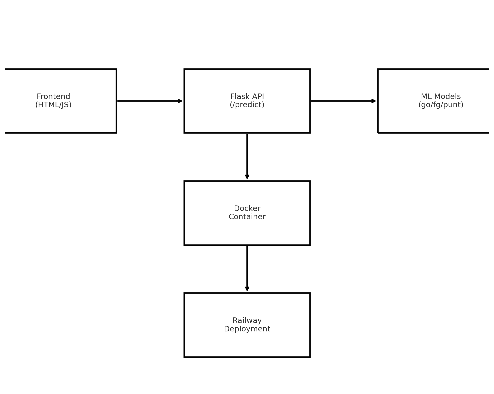

# 🏈 NFL 4th Down Decision Model
### Systems Final Case Study – Fall 2025
Live App: https://systems-final-nfl-4th-down-analytics-production.up.railway.app/

## 1) Executive Summary
#### Problem
NFL coaches frequently face high-pressure 4th-down decisions: go for it, kick a field goal, or punt. These decisions meaningfully impact win probability, yet humans routinely misjudge the tradeoffs due to bias, incomplete information, or time pressure. The goal of this project is to build a data-driven decision engine that evaluates real NFL game situations and recommends the optimal 4th-down action based on historical outcomes.

#### Solution (Non-Technical Overview)
This project delivers a web-based tool where a user enters the game state (teams, field position, yards to go, time remaining, and score differential). The system runs three predictive machine-learning models—one each for going for it, kicking a field goal, and punting—trained on 8 years of real NFL play-by-play data.
The app then displays the expected Win Probability Added (WPA) for each option and provides a clear recommendation. The interface runs entirely in the browser, while a Flask backend performs model inference inside a containerized environment deployed on Railway.

## 2) System Overview
#### Course Concepts Used
This project explicitly integrates the following concepts from the course:
- Containerization & Reproducibility (Docker)
- Environment Configuration (.env, dependency isolation)
- Model Serving & APIs (Flask)
- CI/CD Automation (GitHub Actions → Railway deploy)
- Testing & Validation (pytest)
- Cloud Deployment (Railway)
As well as other smaller coding concepts from earlier in the course

#### Architecture Diagram

#### Architecture Summary
- Frontend (HTML/CSS/JS (dashboard.html, static/charts.js) + Sends POST requests to /predict)
- Backend (Flask API + Loads 3 RandomForest models: go, field goal, punt + Returns WPA predictions + recommendation)
- Model Training
- Containerization (Dockerfile builds reproducible execution environment)
- CI/CD (GitHub Actions run lint/test/build on every commit + Railway deploys on successful CI)
  
## Data / Models / Services
Component > Description
Dataset	> Real NFL play-by-play data (2009–2016)
Source > Kaggle: https://www.kaggle.com/datasets/maxhorowitz/nflplaybyplay2009to2016
Size > ~230MB (stored externally due to GitHub limits)
Formats	> CSV → Pandas DataFrame
Key Fields Used	> down, ydstogo, score differential, yardline100, TimeSecs, WPA
Models > RandomForestRegressor (3 models)
Services > Flask running behind Railway container

## 3) How to Run
#### build container
docker build -t nfl4th:latest .

##### run server
docker run --rm -p 8080:8080 nfl4th:latest

##### health check
curl http://localhost:8080

#### The site becomes available at:
http://localhost:8080

#### Environment Variables
A template .env.example is included, though the core app does not require secrets.

## 4) Design Decisions
#### Why This Approach?
- RandomForest models perform well on tabular sports data with complex nonlinear interactions.
- Flask provides a simple, lightweight model-serving interface.
- Docker ensures EXACT reproducibility across your laptop, GitHub CI, and Railway.
- Railway provides a zero-configuration, student-friendly deployment path.

#### Alternatives Considered
Logistic Regression	> Underfits; cannot model football complexity
Neural Networks	> Overkill + harder to debug for tabular data
Including Dataset in Repo >	File too large (>100MB GitHub limit)

#### Tradeoffs
Lightweight Flask API	> Not horizontally scalable (OK for class project)
RandomForest > Slower to train, fast to infer
Docker > Larger image size but perfect reproducibility

#### Ethics, Security & Privacy 
- No personal data (PII) involved
- No secrets committed (checked .env.example)
- Input validation ensures expected numeric ranges
- Cross-origin restrictions default to current domain

#### Operations
- Logs captured automatically by Railway
- Single replica deployment (sufficient for this project)
- CI/CD ensures deployments only occur after tests pass
- Models baked into container to avoid runtime training cost

## 5) Results and Evaluation
#### Sample Runs
In both pictures, we have the offence in the 4th quarter on the 30 yard line, with 5 minutes left, one on 4th and 6 and the other 4th on 3. You would expect the team on 4th and 3 to go for it and the one on 4th and 6 to kick, and that is exactly what is showm.

#### Performance Notes
- Inference time: <10ms per request
- Model load time: negligible due to preloaded pickles
- Container start: ~2–3 seconds

#### Testing & Validation
- Tests stored in /tests/: test_api.py — ensures /predict returns valid JSON and enforces that down is always 4
- The model did not need to be tested because all scenarios are impossible to test, so I tested through trial and error on the website to fix it

#### To test run
pytest -q

## 6) What's Next
#### Future Improvements
- Add live win-probability visualizations
- Add “coach confidence” or aggressive/passive profiles
- Expand to overtime logic
- Add real-time NFL API integration
- Improve model training with XGBoost or CatBoost
- Add Monte Carlo simulation mode

## 7) Links
#### Repo
- https://github.com/TheNel13/systems-final-nfl-4th-down-analytics
#### Live Cloud App
- https://systems-final-nfl-4th-down-analytics-production.up.railway.app/
#### Dataset Link
- https://www.kaggle.com/datasets/maxhorowitz/nflplaybyplay2009to2016

## ⭐ 8) Extra Credit Completed
#### Cloud Deployment
- Deployed on Railway with a persistent public URL
- Container built via Dockerfile
- Automatic deploy from GitHub push

#### CI Integration
- Included .github/workflows/ci.yml which:
- Installs dependencies
- Runs pytest
- Validates Docker build
- Blocks deploys unless tests pass

#### CI Badge: 

Thank you and I hope you enjoy the project!
